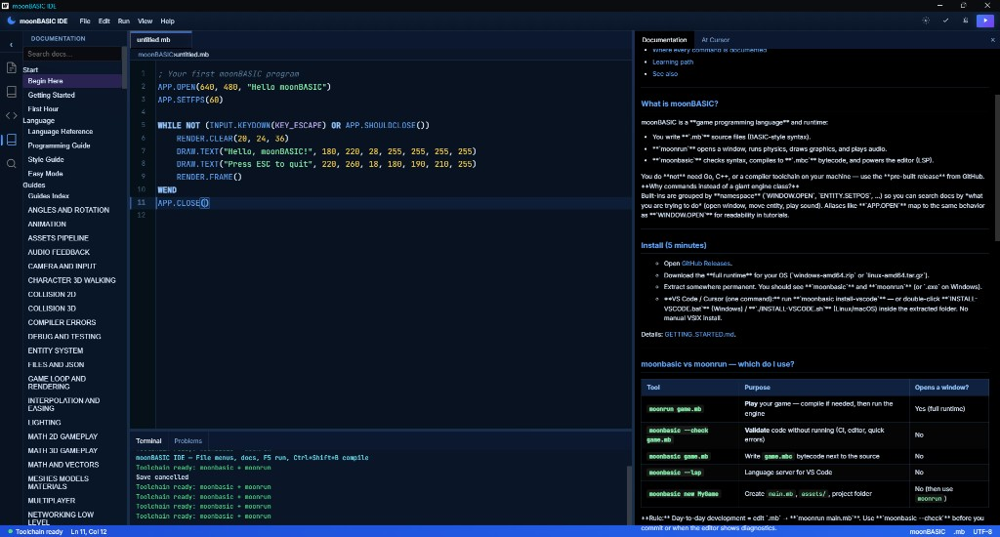

<p align="center">
  <strong>moonBASIC</strong><br/>
  <em>A modern BASIC for games — readable scripts, real compiler, real engine.</em>
</p>

<p align="center">
  <a href="https://github.com/CharmingBlaze/moonbasic/releases/latest"></a>
  <a href="LICENSE"></a>
  <a href="https://github.com/CharmingBlaze/moonbasic/releases/tag/book"></a>
</p>

<p align="center">
  <a href="https://github.com/CharmingBlaze/moonbasic/releases/latest"><strong>Download latest</strong></a>
  ·
  <a href="docs/BEGIN_HERE.md"><strong>Begin here</strong></a>
  ·
  <a href="docs/THE_MOONBASIC_BOOK.md"><strong>Read the Book</strong></a>
  ·
  <a href="examples/"><strong>Examples</strong></a>
</p>

---

**moonBASIC** is a game programming language with a compiler, bytecode VM, and full runtime in one stack. Write `.mb` files. Open a window. Draw 2D or 3D. Bounce things with Box2D or Jolt. Ship a zip.

You do **not** need Go, GCC, CMake, or this repo’s engine guts to make games. Download a release. Extract. Hit **F5**.

This repository is the **official download + docs hub** for **Windows**, **Linux**, and **macOS (Apple Silicon)**.  
Engine source for contributors: **[moonbasic-compiler](https://github.com/CharmingBlaze/moonbasic-compiler)**.



---

## Get it in 30 seconds

### 1. Download (Windows first)

Grab the **IDE bundle** from **[Releases → latest](https://github.com/CharmingBlaze/moonbasic/releases/latest)** (currently **v1.3.3**):

| Platform | File |
|----------|------|
| **Windows x64** | [`moonbasic-v1.3.3-ide-windows-amd64.zip`](https://github.com/CharmingBlaze/moonbasic/releases/download/v1.3.3/moonbasic-v1.3.3-ide-windows-amd64.zip) |
| **Linux x64** | [`moonbasic-v1.3.3-ide-linux-amd64.tar.gz`](https://github.com/CharmingBlaze/moonbasic/releases/download/v1.3.3/moonbasic-v1.3.3-ide-linux-amd64.tar.gz) |
| **macOS Apple Silicon** | [`moonbasic-v1.3.3-ide-macos-arm64.tar.gz`](https://github.com/CharmingBlaze/moonbasic/releases/download/v1.3.3/moonbasic-v1.3.3-ide-macos-arm64.tar.gz) |

Short names like `moonbasic-v1.3.3-windows-amd64.zip` are the **same complete package**. Details: **[RELEASES.md](RELEASES.md)**.

### 2. Extract & launch

| OS | Start |
|----|--------|
| Windows | Extract → run **`START-IDE.bat`** |
| macOS | Extract → run **`START-IDE.command`** |
| Linux | Extract → `chmod +x START-IDE.sh` → **`./START-IDE.sh`** |

Keep every file from the archive together (on Windows that includes any `lib*.dll` next to `moonrun.exe`).

### 3. Run something

Open `samples/hello.mb` → press **F5**.

| Shortcut | Action |
|----------|--------|
| **F5** | Run (`moonrun`) |
| **Ctrl+Shift+C** | Check syntax |
| **Ctrl+Shift+B** | Compile to `.mbc` |
| **Alt+H** | Help at cursor |

---

## What's in the download

Every OS package is a **complete user kit**:

| Piece | What it does |
|-------|----------------|
| **`moonbasic-ide`** | Desktop editor + built-in docs |
| **`moonbasic`** | Compiler, `--check`, LSP |
| **`moonrun`** | Game runtime (window, graphics, physics, audio) |
| **`docs/`** | Full documentation offline |
| **`samples/`** | Starter scripts |

Optional extras on the same Releases page:

| Download | For |
|----------|-----|
| `moonbasic-*-vscode.vsix` | VS Code / Cursor syntax + LSP |
| **`moonBASIC-The-Book.zip`** | The Book — Markdown + Word + PDF |
| [Book release](https://github.com/CharmingBlaze/moonbasic/releases/tag/book) | Book-only assets, easy to find |

> **Tip:** Day-to-day play = **`moonrun game.mb`**. Plain `moonbasic game.mb` only writes bytecode — it does **not** open a window.

---

## Taste of the language

No `#` / `$` / `%` suffixes. Plain names. `Namespace.Method` APIs. Handles that chain.

```basic
APP.OPEN(960, 540, "Hello moonBASIC")
APP.SETFPS(60)

WHILE NOT (INPUT.KEYDOWN(KEY_ESCAPE) OR APP.SHOULDCLOSE())
    RENDER.CLEAR(20, 24, 40)
    DRAW.TEXT("I made a window.", 40, 40, 22, 255, 255, 255, 255)
    RENDER.FRAME()
WEND

APP.CLOSE()
```

Spin a cube, play Pong, hop like a tiny Mario — all in [`examples/`](examples/):

| Try this | Path |
|----------|------|
| Game loop | `examples/guides/game_loop.mb` |
| Pong | `examples/pong/` |
| Spinning cube | `examples/spin_cube/` |
| Third-person hop | `examples/mario64/modern_blitz_hop.mb` |

```bash
moonbasic new MyGame
cd MyGame
moonrun main.mb
```

---

## Learn without drowning

| Path | What you get |
|------|----------------|
| **[The Book](docs/THE_MOONBASIC_BOOK.md)** | Funny full guide — also [Word / PDF](docs/book/) |
| **[BEGIN_HERE.md](docs/BEGIN_HERE.md)** | Install + why the game loop looks like that |
| **[FIRST_HOUR.md](docs/FIRST_HOUR.md)** | Friendly first hour |
| **[GETTING_STARTED.md](docs/GETTING_STARTED.md)** | IDE, shipping, VS Code debug |
| **[LANGUAGE.md](docs/LANGUAGE.md)** | Syntax & language rules |
| **[systems/GUIDES.md](docs/systems/GUIDES.md)** | Topic guides (loop, sprites, physics, …) |
| **[COMMANDS.md](docs/COMMANDS.md)** · **[reference/](docs/reference/)** | Command index & API pages |
| **[RELEASES.md](RELEASES.md)** | What each release asset is |

---

## What the engine can do

| Area | Stack |
|------|--------|
| Window / graphics / audio | **Raylib** (via the full runtime) |
| 2D physics | **Box2D** |
| 3D physics & character controller | **Jolt** |
| Multiplayer | **ENet** (where enabled) |
| Workflow | Same `.mb` path on Windows & Linux |

Write 2D or 3D in one language. Prefer modern `CAMERA.CREATE` / `ENTITY.SETPOS` / handle methods; Easy Mode Blitz-style names still exist if you’re porting old muscle memory.

---

## Terminal workflow

`moonbasic` and `moonrun` live next to the IDE. Optional: run **ADD-TO-PATH**.

```bash
moonrun --version
moonbasic --check main.mb
moonrun main.mb
moonbasic main.mb          # writes main.mbc
moonbasic install-vscode   # from a full-runtime / IDE extract
```

**VS Code / Cursor:** install `moonbasic-*-vscode.vsix` from Releases (Extensions → Install from VSIX), or use the all-in-one IDE.

---

## Ship a game to friends

1. Keep the **same release tag** you tested with.
2. Zip `moonrun` + your `.mb` / `.mbc` + `assets/` (or tell players to install the same full runtime).
3. Give them a one-line launcher: `moonrun main.mb`.

More: **[GETTING_STARTED.md — Ship your game](docs/GETTING_STARTED.md)**.

---

## Contributing / building from source

This hub is **downloads + docs + examples**. It is **not** the engine build tree.

| Want | Go |
|------|-----|
| Play / learn | Stay here — [Releases](https://github.com/CharmingBlaze/moonbasic/releases/latest) |
| Hack the compiler / runtime / IDE | **[moonbasic-compiler](https://github.com/CharmingBlaze/moonbasic-compiler)** |

---

## License

**MIT** — see [LICENSE](LICENSE).

<p align="center">
  <a href="https://github.com/CharmingBlaze/moonbasic/releases/latest">Download</a>
  ·
  <a href="docs/THE_MOONBASIC_BOOK.md">The Book</a>
  ·
  <a href="https://github.com/CharmingBlaze/moonbasic-compiler">Engine source</a>
</p>
