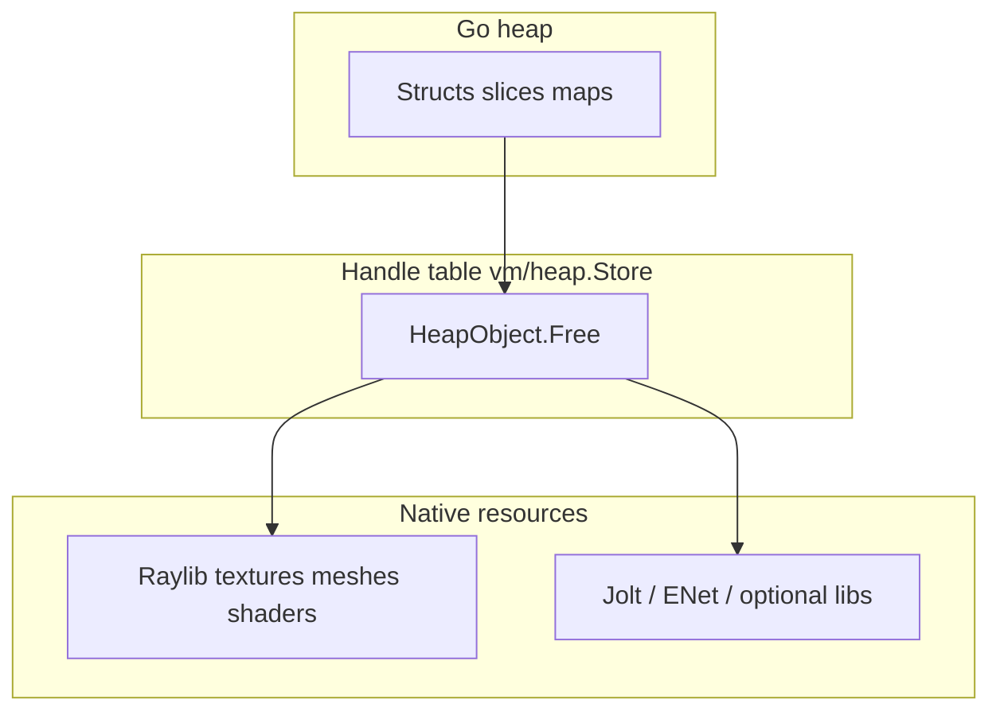

# moonBASIC memory model

This document describes how **Go**, **CGo/native** (Raylib, optional Jolt/ENet), and the **handle table** interact. It is the reference for contributors auditing leaks or adding new `HeapObject` types.

## Three layers

1. **Go heap** — Managed by the GC. Ordinary Go values, slices backing arrays, string pool metadata in the heap store, etc.
2. **CGo / native** — **Not** traced by the Go GC. Every `rl.Load*`, `rl.GenMesh*`, `enet.NewHost`, Jolt body/shape, etc. must have a matching `Unload*`, `Destroy`, or library-specific teardown. These calls run inside `HeapObject.Free()` (or module shutdown for globals such as `CloseWindow`).
3. **Handle table** — `vm/heap.Store` registers each resource that is exposed to moonBASIC as an opaque handle. See [`vm/heap/heap.go`](../vm/heap/heap.go): `Alloc`, `Free`, `FreeAll`, generation bits for use-after-free detection.

## Contracts (from `HeapObject` comments)

- **`Free()` must be idempotent.** Prefer [`heap.ReleaseOnce`](../vm/heap/release_once.go) around Raylib/Jolt unload paths, or an early `if freed { return }` with `freed = true` at the end.
- **`TypeTag()` must be unique** per class — see [`vm/heap/heap_tags.go`](../vm/heap/heap_tags.go). Wrong-type `Cast` is a deliberate error.
- **`Store.FreeAll()`** walks all slots and calls `Free()` on live objects — used at process teardown and when [`Window.Close`](../runtime/window/raylib_cgo.go) frees the heap mid-script. Scripts **should** call `*.Free` for long-running games; `FreeAll` is the safety net.

## Owned vs shared (examples)

| Pattern | Rule |
|--------|------|
| **TextureObject** | Owns `rl.Texture2D`; always `UnloadTexture` in `Free`. |
| **MaterialObject** | Owns material unless `moved` into a model — then model owns it; see [`materialObj`](../runtime/mbmodel3d/heap_types_cgo.go). |
| **ModelObject** | Owns `rl.Model` (meshes + embedded materials); `UnloadModel` releases children. |
| **WaterObject / terrain chunkSlot** | Each owns mesh **and** `LoadMaterialDefault()` material — **both** must be unloaded (see terrain/water `Free` and streaming unload). |
| **Physics** | Bodies/shapes: Jolt destruction order is enforced in [`runtime/physics3d`](../runtime/physics3d/) (Linux); stubs on unsupported OS — see [ARCHITECTURE.md](../ARCHITECTURE.md) §12. |

## Destruction order (rules of thumb)

| Resource | Free before / notes |
|----------|---------------------|
| Model animations | Before parent model if using separate animation APIs (Raylib `UnloadModelAnimation` / model unload order in `modelObj`). |
| Model | Unloads meshes/materials it owns. |
| Terrain chunk | `UnloadMaterial` then `UnloadMesh` when evicting a chunk or on full `TerrainObject.Free`. |
| ENet host | Destroying host disconnects peers; peer handles become invalid — see [`runtime/net`](../runtime/net/). |

## Goroutines

The runtime avoids background workers for terrain mesh builds (main-thread Raylib). A grep for `go ` under `runtime/` shows only short-lived helpers (e.g. process wait) — see `GOROUTINES.txt` in the repo root for the audit snapshot.

## Verification

- **Unit tests:** `go test ./vm/heap/...` — includes `FreeAll` and double-free-on-handle behavior.
- **Baselines:** `RACE_BASELINE.txt`, `GCCHECK_BASELINE.txt`, `ESCAPE_ANALYSIS.txt` (committed; re-run after large changes).
- **Valgrind:** Linux/WSL — run `go build -o moonbasic_test .` then `valgrind --leak-check=full ./moonbasic_test testdata/memtest_freeall.mb` (see `VALGRIND_BASELINE.txt` placeholder on Windows).

## Test programs

| File | Purpose |
|------|---------|
| [`testdata/memtest_freeall.mb`](../testdata/memtest_freeall.mb) | Leak intentional handles; shutdown `FreeAll` must reclaim. |
| [`testdata/memtest_basic.mb`](../testdata/memtest_basic.mb) | Tight create/free loop. |
| [`testdata/memtest_streaming.mb`](../testdata/memtest_streaming.mb) | Terrain load/unload churn. |

All should pass `go run . --check <file>`.

## Per-frame allocation budget

Hot paths (VM inner loop, frustum tests, per-pixel work) should avoid unnecessary allocations. Full `DEBUG.FRAMEALLOC` is not part of the core engine yet; use `runtime.MemStats` in profiling builds if needed. Escape analysis: `go build -gcflags="-m"` (see `ESCAPE_ANALYSIS.txt`).
